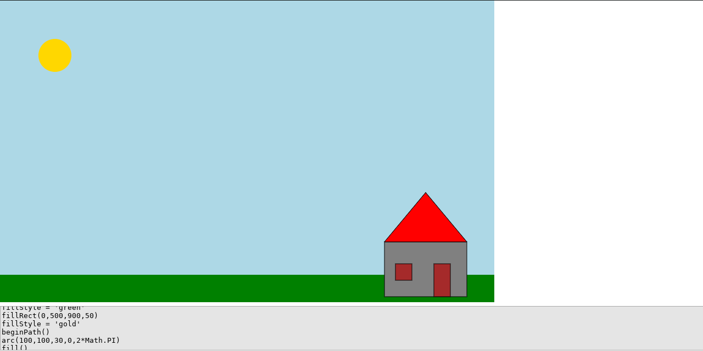

# my Canvas

A very hacky app that exposes a canvas so you can draw and plot things with [JavaScript Canvas Code](https://www.w3schools.com/html/html5_canvas.asp).

[Live Version](https://victorribeiro.com/myCanvas)

## About

Some times I really need a canvas to plot or draw something, so I came up with this very hacky way of exposing a canvas as an app. Hope is usefull to you.

## How to use it

Type code as you would type when programming a canvas application. Hit enter do execute the code.
